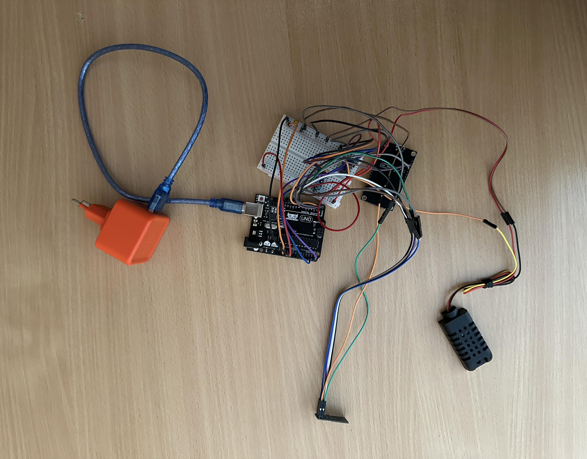

# Центральная станция Arduino (метеостанция)

Этот модуль является основой системы умной метеостанции.  
Он собирает данные с подключённых локальных сенсоров + принимает данные от внешней outdoor станции по радиоканалу (NRF24L01), формирует общий JSON и передаёт данные по Serial на ESP

## Аппаратное подключение

**Используется плата:** Arduino Uno

### Схема подключения:

- **DHT21 (AM2301)**  
    - DATA → Digital Pin 2  
    - VCC → 5V шина макетки  
    - GND → общий GND макетки  

- **BMP180** (I2C шина)  
    - SDA → A4  
    - SCL → A5  
    - VCC → 3.3V шина макетки  
    - GND → общий GND макетки  

- **SGP30** (I2C шина)  
    - SDA → A4  
    - SCL → A5  
    - VCC → 5V шина макетки  
    - GND → общий GND макетки  

- **NRF24L01**  
    - CE → D9  
    - CSN → D10  
    - MOSI → D11  
    - MISO → D12  
    - SCK → D13  
    - VCC → 3.3V (*НЕ 5V!*)  
    - GND → общий GND макетки  
    - Рекомендуется установить **10 μF конденсатор  (тантал или электролит)** между VCC и GND модуля NRF24L01 для стабилизации питания

- **ESP8266**
    - RX ESP → TX Arduino (Рекомендуется установить через делитель напряжения)  
    - TX ESP → RX Arduino  
    - GND ESP → общий GND макетки  
    - VIN ESP → 5V шина макетки  

**Питание:**  
Станция питается от **сетевого блока питания (5V USB адаптер)** через USB кабель к Arduino Uno.
Сетевой блок питания обеспечивают стабильное питание 5V для всей схемы. 3.3V для NRF24 и BMP180 берётся с выхода Arduino Uno. Все устройства используют общий GND макетки

**Фото сборки**  



## Настройка

Настройки находятся в файле **config.h**:

```cpp
#define DHT_PIN 2
#define DHT_TYPE DHT21
#define SENSOR_READ_INTERVAL 5000
#define BASELINE_SAVE_INTERVAL 3600000UL
```

## Необходимые библиотеки

В Arduino IDE → Менеджер библиотек:

- **DHT sensor library** (Adafruit)
- **Adafruit BMP085 Unified**
- **Adafruit SGP30**
- **Adafruit Sensor**
- **RF24** (TMRh20 fork)
- **ArduinoJson** (автор Benoit Blanchon, версия 6.x)

> Рекомендуется использовать официальную Arduino Uno или качественный совместимый клон с хорошим 3.3V стабилизатором

## Как работает

1. Центральная Arduino собирает данные с датчиков температуры, влажности, давления, качества воздуха
2. Принимает данные с outdoor Arduino станции (T:..;H:..;P:..)
3. Формирует JSON вида:
```json
{
  "central": { "temperature": ..., "humidity": ..., "pressure": ..., "co2": ..., "tvoc": ... },
  "outdoor": { "temperature": ..., "humidity": ..., "pressure": ... }
}
```
4. Отправляет JSON по Serial → ESP ловит и отправляет данные на сервер

## Файлы проекта

- `central.ino` — основной скетч
- `config.h` — настройки пинов и интервалов
- `sensors.cpp / sensors.h` — модуль работы с датчиками
