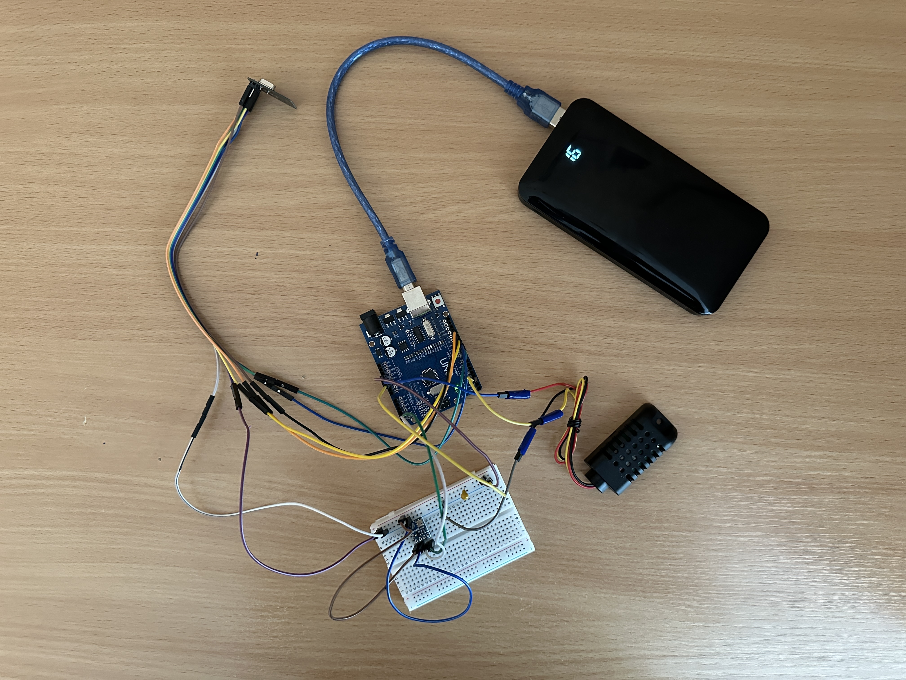

# Уличная станция Arduino (метеостанция)

Этот модуль используется как внешняя outdoor станция в системе умной метеостанции.  
Он собирает данные с локальных датчиков (температура, влажность, давление) и передаёт их по радиоканалу NRF24L01 к центральной Arduino станции

## Аппаратное подключение

**Используется плата:** Arduino Uno

### Схема подключения:

- **DHT21 (AM2301)**  
    - DATA → Digital Pin 2  
    - VCC → 5V шина макетки  
    - GND → общий GND макетки  

- **BMP180** (I2C шина)  
    - SDA → A4  
    - SCL → A5  
    - VCC → 3.3V шина макетки  
    - GND → общий GND макетки  

- **NRF24L01**  
    - CE → D9  
    - CSN → D10  
    - MOSI → D11  
    - MISO → D12  
    - SCK → D13  
    - VCC → 3.3V (*НЕ 5V!*)  
    - GND → общий GND макетки  
    - Рекомендуется установить **10 μF конденсатор (тантал или электролит)** между VCC и GND модуля NRF24L01 для стабилизации питания

**Питание:**  
Станция подключена к **power bank → Arduino Uno USB**. Power bank даёт стабильные 5V для питания всей схемы.  
3.3V для NRF24 и BMP180 берётся с выхода Arduino Uno. Все устройства используют общий GND макетки

**Фото сборки** 




## Настройка

Настройки находятся в файле **config.h**:

```cpp
#define DHT_PIN 2
#define DHT_TYPE DHT21
#define SENSOR_READ_INTERVAL 5000
```

## Необходимые библиотеки

В Arduino IDE → Менеджер библиотек:

- **DHT sensor library** (Adafruit)
- **Adafruit BMP085 Unified**
- **Adafruit Sensor**
- **RF24** (TMRh20 fork)

> Рекомендуется использовать официальную Arduino Uno или качественный совместимый клон с хорошим 3.3V стабилизатором

## Как работает

1. Outdoor Arduino собирает данные с датчиков температуры, влажности, давления
2. Формирует строку: `T:..;H:..;P:..`
3. Передаёт строку по радиоканалу NRF24L01 к центральной станции

## Файлы проекта

- `outdoor.ino` — основной скетч
- `config.h` — настройки пинов и интервалов
- `sensors.cpp / sensors.h` — модуль работы с датчиками
